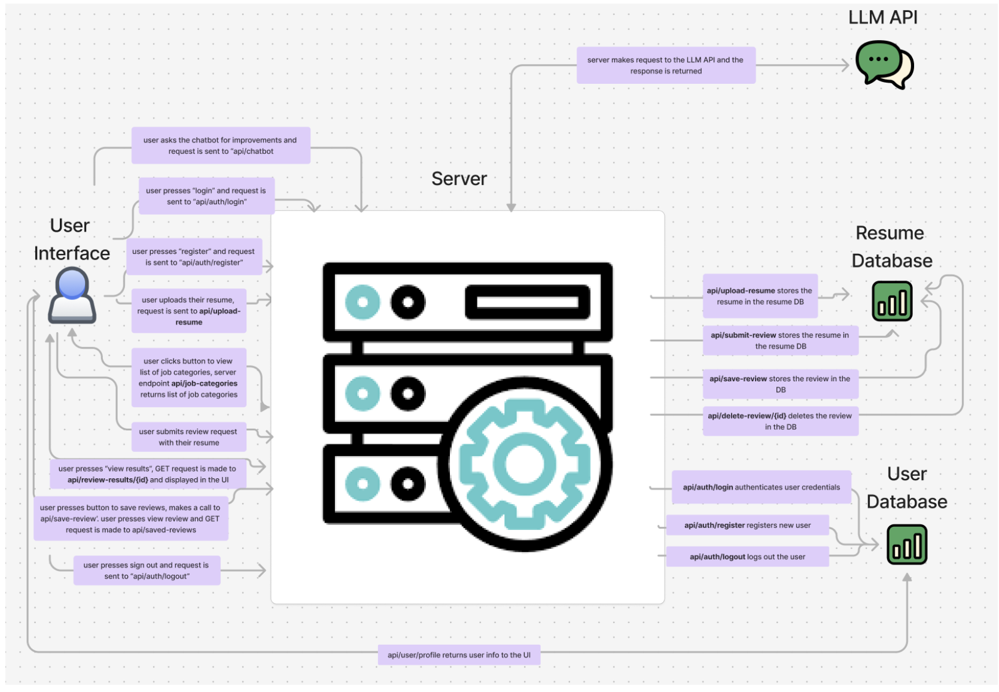

# RÉVISEMÉ

### Group 5: 
- **Carlos Carrillo-Sandoval**
- **Renusree Chittella**
- **Ayaan Rahim**
- **Olivia Sapp**

### Deployed render URL:
- https://info441-final-ozwd.onrender.com

### Figma Design
[Figma Board - Resume Builder](https://www.figma.com/board/X93Bdr4Ct5KA1xi94V2tCj/Resume-Builder?node-id=0-1&t=hn7VfT08u4kX7XnE-1)

---

## Project Description
RÉVISEMÉ is an AI-powered Resume Reviewer designed to help users improve their resumes to match the qualifications and keywords required for specific job descriptions. By leveraging a large-language-model (LLM) API, our website provides users with immediate, tailored feedback upon uploading their resumes.

### Target Audience
Our tool is particularly beneficial for:
- Recent college graduates
- Individuals seeking to tailor their resumes for new job opportunities
- People re-entering the job market after a break

Our goal is to help users improve their chances of passing the initial stages of the hiring process by crafting resumes that align with the standards of Applicant Tracking Systems (ATS) and highlight the skills necessary for the target job.

### Inspiration
As college seniors, we understand the challenge of advancing through the initial stages of hiring, especially when many applications are filtered out without direct recruiter contact. We hope to reduce these occurrences by helping users enhance their resumes, making them more likely to reach the interview stage.

---

## Architectural Diagram

---

## User Stories and Priorities

| Priority | User | Description | Technical Implementation |
|----------|------|-------------|--------------------------|
| **P0** | Early Career User | Receive feedback on resume structure, ATS compliance, and bullet point wording. | User uploads resume via `api/upload-resume` (POST). The AI analyzes and provides feedback, which is saved to the Resume Database and accessible via `api/review-results` (GET). |
| **P1** | College Student | Create different resumes for specific roles/jobs. | User selects job categories via `api/job-categories` (GET), which lists available job types. |
| **P2** | Career Switcher | Tailor resume to fit a new role based on job description input. | User uploads resume and job description via `api/submit-review` (POST). The system customizes the resume to match the job requirements. |
| **P3** | Users Without In-Person Resources | Interact with a chatbot for resume improvement advice. | A websocket opens for continuous communication with the server. The server queries an LLM, providing real-time feedback to the user. |
| **P4** | All Users | Save different resume versions and feedback for future access. | User logs in via `api/auth/login` (POST) and uploads their resume via `api/upload-resume` (POST). The resume and feedback are stored in the Resume Database with a unique user-linked ID. |

---

## API Endpoints

### Resume Management
- **Upload Resume**  
  - Endpoint: `api/upload-resume`
  - Method: `POST`

- **Get Job Categories**  
  - Endpoint: `api/job-categories`
  - Method: `GET`

- **Submit Review Request**  
  - Endpoint: `api/submit-review`
  - Method: `POST`

- **Get Review Results**  
  - Endpoint: `api/review-results/{id}`
  - Method: `GET`

- **Save Review**  
  - Endpoint: `api/save-review`
  - Method: `POST`

- **Get Saved Reviews**  
  - Endpoint: `api/saved-reviews`
  - Method: `GET`

- **Delete Saved Review**  
  - Endpoint: `api/delete-review/{id}`
  - Method: `DELETE`

### User Authentication
- **Login**  
  - Endpoint: `api/auth/login`
  - Method: `POST`

- **Register**  
  - Endpoint: `api/auth/register`
  - Method: `POST`

- **Logout**  
  - Endpoint: `api/auth/logout`
  - Method: `POST`

- **User Profile**  
  - Endpoint: `api/user/profile`
  - Method: `GET`
